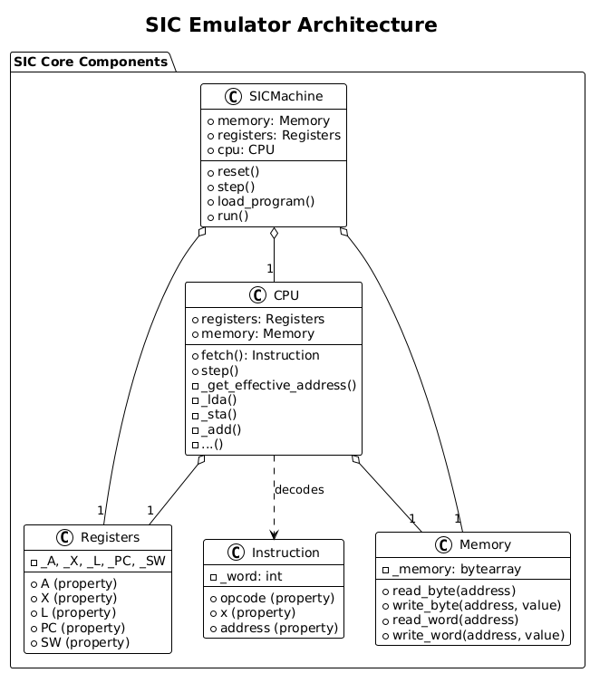
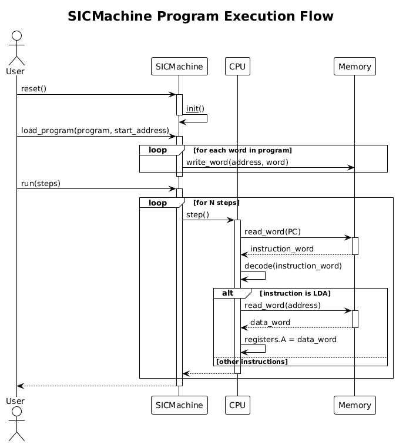

# 🧠 SIC Emulator (Simplified Instructional Computer)

Welcome to the **SIC Emulator** project — an educational emulator for the [SIC architecture](https://en.wikipedia.org/wiki/Simplified_Instructional_Computer) as defined in the textbook **_System Software: An Introduction to System Programming_** by **Leland L. Beck**.

This project is built with:
- **Python 3**
- **Test-Driven Development (TDD)**
- **Object-Oriented Design (OOD)**

We aim to build a faithful software simulation of the SIC architecture, later extendable to **SIC/XE**, with a clean, testable, and modular codebase.

---

## 📌 Goals

- ✔ Emulate the SIC CPU and memory
- ✔ Support core SIC instructions and addressing modes
- ⏳ Eventually extend to **SIC/XE**
- 🧪 Fully tested with unit tests using TDD
- 🧱 Modular and extensible via Object-Oriented Design

---

## 🧩 Architecture Overview

### Core Components

| Module         | Description |
|----------------|-------------|
| `memory.py`    | Implements 32K byte-addressable memory |
| `registers.py` | Implements SIC registers: A, X, L, PC, SW |
| `instruction.py` | Abstract base and concrete instruction classes |
| `cpu.py`       | The SIC processor: fetch-decode-execute cycle |
| `machine.py`   | Integrates CPU + Memory + Loader |
| `assembler/`   | (future) Converts SIC assembly to object code |
| `tests/`       | Unit tests for all components |

---

