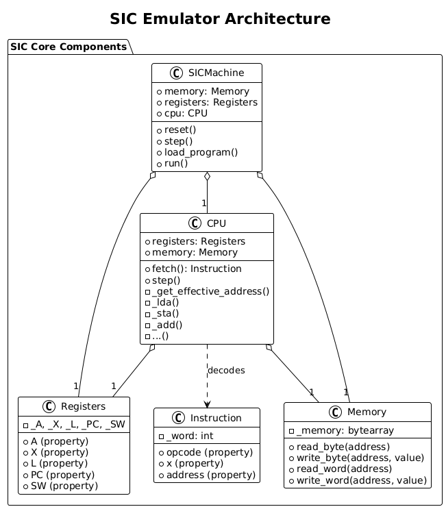
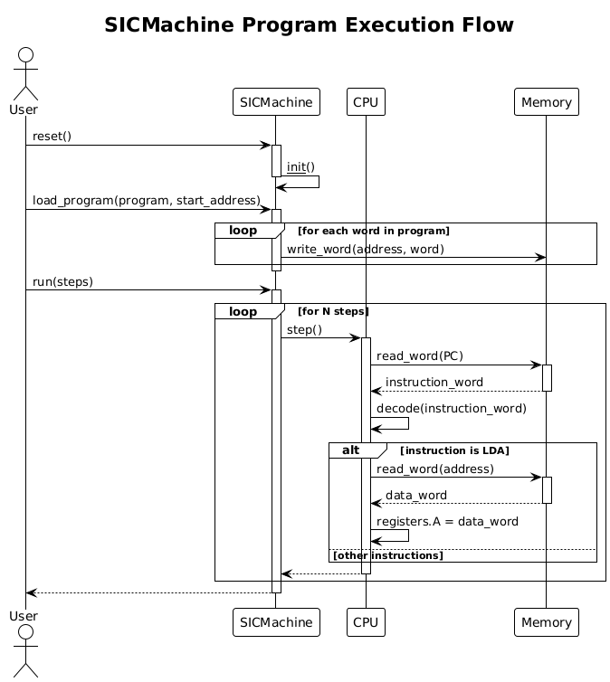

# 🧠 SIC Emulator (Simplified Instructional Computer)

Welcome to the **SIC Emulator** project — an educational emulator for the [SIC architecture](https://en.wikipedia.org/wiki/Simplified_Instructional_Computer) as defined in the textbook **_System Software: An Introduction to System Programming_** by **Leland L. Beck**.

This project is built with:
- **Python 3**
- **Test-Driven Development (TDD)**
- **Object-Oriented Design (OOD)**

We aim to build a faithful software simulation of the SIC architecture, later extendable to **SIC/XE**, with a clean, testable, and modular codebase.

---

## 📌 Goals

- ✔ Emulate the SIC CPU and memory
- ✔ Support core SIC instructions and addressing modes
- ⏳ Eventually extend to **SIC/XE**
- 🧪 Fully tested with unit tests using TDD
- 🧱 Modular and extensible via Object-Oriented Design

---

## 🧩 Architecture Overview

### Core Components

| Module         | Description |
|----------------|-------------|
| `memory.py`    | Implements 32K byte-addressable memory |
| `registers.py` | Implements SIC registers: A, X, L, PC, SW |
| `instruction.py` | Abstract base and concrete instruction classes |
| `cpu.py`       | The SIC processor: fetch-decode-execute cycle |
| `machine.py`   | Integrates CPU + Memory + Loader |
| `assembler/`   | Converts SIC assembly to object code (Pass 1 implemented) |
| `tests/`       | Unit tests for all components |

---

## ✅ Completed Tasks

### Core Emulator
- **Memory**: 32KB byte-addressable memory with read/write operations (byte and word).
- **Registers**: Implementation of A, X, L, PC, SW registers.
- **CPU**: Fetch-Decode-Execute cycle loop.
- **Instructions**:
    - Load/Store: `LDA`, `STA`
    - Arithmetic: `ADD`, `SUB`
    - Comparison: `COMP`
    - Jump: `J`, `JEQ`
- **Machine**: Integration of CPU and Memory.

### Assembler (Pass 1)
- **Parser**: Parsing of assembly lines into Label, Mnemonic, and Operand.
- **Symbol Table**: Management of labels and addresses.
- **Opcode Table**: Lookup for mnemonic opcodes.
- **Directive Handling**: Support for `START`, `END`, `WORD`, `BYTE`, `RESW`, `RESB`.
- **Pass One Logic**: Address assignment and symbol table generation.

---

## 📝 TODO List

The following tasks are planned for future development:

1. **Assembler Pass 2**
   - Generate Object Code for instructions.
   - Generate Header (H), Text (T), and End (E) records.
   - Handle forward references using the symbol table.

2. **Additional Instructions**
   - Implement Index Register instructions: `LDX`, `STX`.
   - Implement Linkage Register instructions: `JSUB`, `RSUB`.
   - Implement Loop/Index comparison: `TIX`.
   - Implement I/O instructions: `RD`, `WD`, `TD`.
   - Implement remaining arithmetic/logic: `MUL`, `DIV`, `AND`, `OR`.

3. **Loader**
   - Implement an Absolute Loader to parse Object Code files and load them into memory.

4. **SIC/XE Extension**
   - 1MB Memory support.
   - Additional Registers (B, S, T, F).
   - Floating Point Arithmetic (`ADDF`, `SUBF`, `MULF`, `DIVF`).
   - Format 4 Instructions (Extended Addressing).
   - Register-to-Register Instructions (Format 2).
   - Immediate and Indirect Addressing modes.

5. **I/O Device Simulation**
   - Simulate input and output devices (e.g., keyboard, display, file).

6. **Integration Testing**
   - End-to-end tests: Assemble a source file -> Load Object Code -> Run in Emulator -> Verify Output.

---

